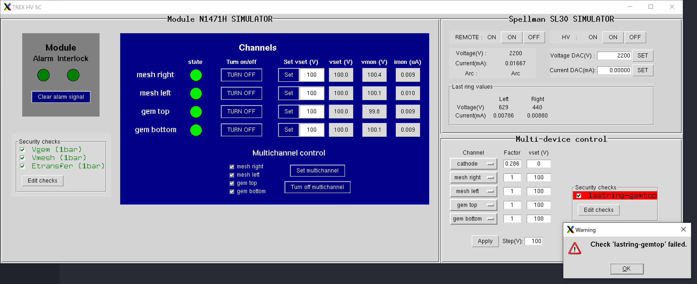

# TREX-DM Slow Control HV

This repository contains software for remote control and monitoring of high voltage (HV) power supplies, primarily used for the TREX-DM experiment.



## Features
- Graphical User Interface (GUI) for individual and multiple HV power supply devices. Including:
   - Security checks for individual and multiple devices.
   - Register of voltage and current monitor values of the channels of each device.
   - Automatic multidevice raising of voltages and turning off following the standard protocol (raising or lowering all channels involved voltages simultaneously by steps).
   - Alert message to slack webhook when the CAEN device is in alarm state (to do so, copy your slack webhook in the function `send_slack_message` of [caengui.py](caengui.py)).
- CAEN and Spellman SL30 simulators for testing without hardware.

## Usage

1. Clone the repository:
   ```bash
   git clone https://github.com/AlvaroEzq/trex-slowcontrolHV.git
   ```
2. Run the main GUI
   ```bash
   python3 trex_HV_gui.py
   ```
   Or run it with the simulators for testing (so the hardware is not needed)
   ```bash
   python3 trex_HV_gui.py --test
   ```
   You can also run the individual devices GUI independently. For example,
   ```bash
   python3 caen_gui.py --port /dev/ttyUSB0
   ```

## Requirements

- Python 3.x
- tkinter (for installation check [this](https://stackoverflow.com/a/74607246)).
- Additional python libraries listed in `requirements.txt`.

## Project Structure

- GUIs modules
   - `trex_HV_gui.py`: **Main GUI** that contains individual interfaces for CAEN and Spellman HV devices, as well as multi-device control.
   - `devicegui.py`: Implementation of the abstract class that serves as base class for the individual devices GUIs. This abstract class implements a device lock for multithreading-safe communication with the device and a command queue to keep the order of the communications to the device. Please, use the `issue_command` method (or at least acquire the device lock manually) for any function (or statement) that requires to communicate with the device to avoid spurious errors. To write the individual device GUI, define your class as a children of this base class and implement the appropiate `read_values` (for background monitoring) and `create_gui` (for the GUI layout) abstract methods for your particular case. Do not forget to call the parent class constructor (`super().__init__`) at the end of your the class constructor (`__init__`), as it will start the GUI mainloop and any line written after this will not be executed (until the GUI is closed). You can use the following as examples:
      - `caengui.py`: GUI for CAEN HV devices.
      - `spellmangui.py`: GUI for Spellman HV devices.
   - `tooltip.py`: Tooltip handler.
   - `checksframe.py`: Implementation of the ChecksFrame class to display and manage the checks.
- Device modules
   - `spellmanClass.py`: Class for managing the Spellman HV supply.
   - `simulators.py`: CAEN and Spellman device simulator classes.
- Support modules
   - `check.py`: Implementation of the checks classes.
   - `logger.py`: Implementation of the ChannelState class.
