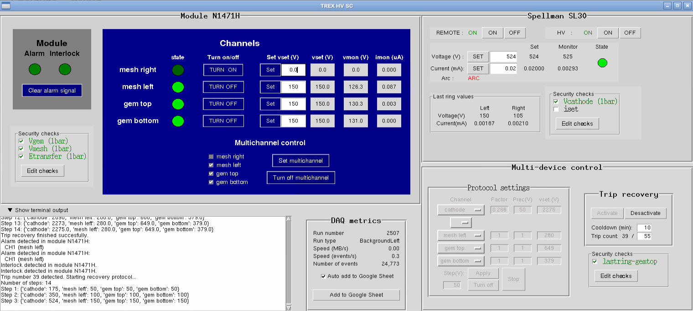

# TREX-DM Slow Control HV

This repository contains software for remote control and monitoring of high voltage (HV) power supplies, primarily used for the TREX-DM experiment.



## Features
- Graphical User Interface (GUI) for individual and multiple HV power supply devices. Including:
   - Security checks for individual and multiple devices.
   - Register of voltage and current monitor values of the channels of each device.
   - Automatic multidevice raising of voltages and turning off following the standard protocol (raising or lowering all channels involved voltages simultaneously by steps).
   - Trip recovery system to automatically detect, handle and recover a trip. It uses the multidevice raising of voltages to recover a trip. Also, a configurable cooldown time is applied before recovering the trip.
   - Alert message to slack/mattermost webhook (to do so, copy your slack/mattermost webhook in the global variable SLACK/MATTERMOST_WEBHOOK_URL of [logger.py](logger.py)). You can select the logging level os the slack messages in the config menu bar. These are the logging levels logic:
      * CRITICAL: unexpected error happens which require the user to fix.
      * ERROR: expected error happens which require the users attention.
      * WARNING: expected event as trips.
      * INFO: information on the normal functioning of the program, including trip recovery messages when a trip is detected and recovered successfully.
      * DEBUG: debugging information.

      It is recommended to set the slack/mattermost logging level to warning if you want to receive messages when trips happen or error if you want to ignore the messages of trips.
   - DAQ monitoring through the [feminos-daq](https://github.com/rest-for-physics/feminos-daq) or [femdaq](https://github.com/juanangp/femdaq) prometheus metrics. As the current DAQ computer is different from the slow-control PC, an ssh connection is established. Make sure to have the necessary ssh key-pair user credentials installed (on the DAQ PC) for the SSH key-based authentication.
   - Auto and manual button to add the current run information (run number, run type, metadata in the output file name, voltages and electronic threshold) to the Google Sheet run list. To configure the connection to the Google Sheet you should change the global variables at `utils.py`. Make sure to have the appropiate google service account credentials (json file) in the root directory.
- CAEN and Spellman SL30 simulators for testing without hardware.

## Usage

1. Clone the repository:
   ```bash
   git clone https://github.com/AlvaroEzq/trex-slowcontrolHV.git
   ```
2. Run the main GUI (all the subsystems, with the sidebar to switch between them)
   ```bash
   python3 supergui.py
   ```
   Or run it with the simulators for testing (so the hardware is not needed)
   ```bash
   python3 supergui.py --test
   ```
   You can also run a single subsystem independently. For example, the HV one:
   ```bash
   python3 multiHVgui.py
   python3 multiHVgui.py --test
   ```
   Or even the GUI of an individual device. For example,
   ```bash
   python3 caengui.py --port /dev/ttyUSB0
   ```

## Requirements

- Python 3.x
- tkinter (for installation check [this](https://stackoverflow.com/a/74607246)).
- Additional python libraries listed in `requirements.txt`.

## GUI architecture

The GUIs are organized in three levels, and every level can be used on its own:

```text
SuperGUI                     (sidebar + navigation, owns the Tk root)
├── HVGUI (MultiDeviceGUI)   (a subsystem: CAEN + Spellman + DAQ metrics + ...)
│   ├── CaenHVPSGUI (DeviceGUI)
│   ├── SpellmanFrame (DeviceGUI)
│   └── ...
└── RigolsGUI (MultiDeviceGUI)
    ├── RigolGUI (DeviceGUI)
    └── ...
```

Two rules define the architecture:

1. **Hardware acquisition and GUI rendering are separated.** Each `DeviceGUI` runs its
   own background read loop that calls `read_values()` (hardware communication +
   internal state update + logging, never Tk widgets), while `update_gui()` runs in
   the Tk main thread and only reads the state to update the widgets (never blocking
   hardware communication). They communicate exclusively through the `ChannelState`
   of each channel.
2. **The highest-level GUI owning a group of GUIs is responsible for their GUI
   scheduling.** This is controlled by the `auto_gui_update` argument: a GUI created
   with `auto_gui_update=True` (the default, standalone use) owns an `after()` loop
   calling its own `update_gui()` every `gui_update_time` seconds, and a GUI created
   with `auto_gui_update=False` (managed use) never schedules an `after()` callback
   and relies on its parent calling `update_gui()`.

| Object           | Standalone             | Managed by a parent |
| ---------------- | ---------------------- | ------------------- |
| `DeviceGUI`      | `auto_gui_update=True` | `False`             |
| `MultiDeviceGUI` | `auto_gui_update=True` | `False`             |
| `SuperGUI`       | N/A                    | owns the scheduler  |

So there is a single `after()` GUI update loop in the application, and in the
`SuperGUI` case only the subsystem currently displayed updates its widgets. Note
that `auto_gui_update` only controls the Tk widget updates: **the background reading
and the logging of a hidden subsystem keep running**, only its rendering is stopped.

Regarding the Tk hierarchy, `self.root` is always the actual Tk root of the
application, while `self.frame` is the widget container owned by each GUI object:

```text
Tk root
└── SuperGUI content frame
    ├── HVGUI.frame
    │   ├── CaenHVPSGUI.frame
    │   └── SpellmanFrame.frame
    └── RigolsGUI.frame
        ├── RigolGUI.frame
        └── RigolGUI.frame
```

Only the top level runs `mainloop()`: a `DeviceGUI` or a `MultiDeviceGUI` starts it
only when it is the standalone/top-level GUI (i.e. when no `parent_frame` is given).

## Project Structure

- GUIs modules
   - `supergui.py`: **Main GUI** that contains the different subsystems (HV, ...) and the sidebar to navigate between them. It owns the only GUI update scheduler of the application.
   - `multidevicegui.py`: Implementation of the abstract class that serves as base class for the subsystem GUIs (a group of device GUIs). Implement the `create_gui` abstract method, creating there the children `DeviceGUI`s with `auto_gui_update=False` inside `self.frame` and registering them in `self.all_guis`.
   - `multiHVgui.py`: **HV subsystem GUI** that contains individual interfaces for CAEN and Spellman HV devices, as well as multi-device control. It can be run on its own.
   - `multirigolgui.py`: Subsystem GUI grouping several Rigol power supplies. It can be run on its own.
   - `devicegui.py`: Implementation of the abstract class that serves as base class for the individual devices GUIs. This abstract class implements a device lock for multithreading-safe communication with the device and a command queue to keep the order of the communications to the device. Please, use the `issue_command` method (or at least acquire the device lock manually) for any function (or statement) that requires to communicate with the device to avoid spurious errors. To write the individual device GUI, define your class as a children of this base class and implement the appropiate `read_values` (for background monitoring) and `create_gui` (for the GUI layout) abstract methods for your particular case. Do not forget to call the parent class constructor (`super().__init__`) at the end of your the class constructor (`__init__`), as it will start the GUI mainloop (when used standalone) and any line written after this will not be executed (until the GUI is closed). Build the widgets of the GUI inside `self.frame` and forward the `auto_gui_update` argument to `super().__init__`. You can use the following as examples:
      - `caengui.py`: GUI for CAEN HV devices.
      - `spellmangui.py`: GUI for Spellman HV devices.
      - `rigolgui.py`: GUI for Rigol power supplies.
      - `daqmetricsgui.py`: GUI for the DAQ metrics.
   - `checksframe.py`: Implementation of the ChecksFrame class to display and manage the checks.
   - `utilsgui.py`: Implementation of GUI utility classes such as ToolTip and PrintToTextWidget.
- Device modules
   - `spellmanClass.py`: Class for managing the Spellman HV supply.
   - `simulators.py`: CAEN and Spellman device simulator classes.
- Support modules
   - `check.py`: Implementation of the checks classes.
   - `logger.py`: Implementation of the ChannelState class and logging helper functions and classes.
   - `metrics_fetcher.py`: Implementation of MetricsFetcher and MetricsFetchcerSSH to extract the prometheus metrics of the [feminos-daq](https://github.com/rest-for-physics/feminos-daq) acquisition program.
   - `utils.py`: Other useful functions. For now, it includes the necessary functions for adding rows to the Google Sheet run list.
